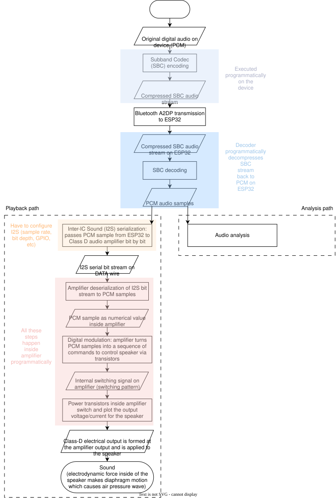
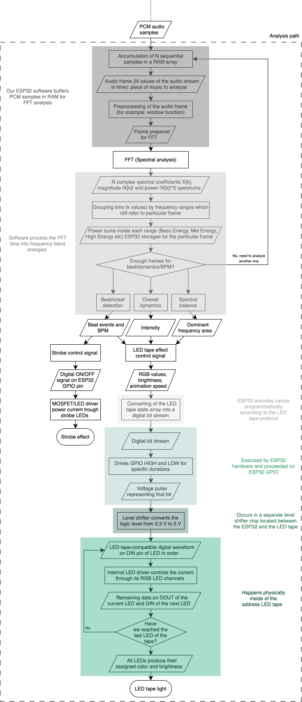

# Spectrum

## Интерактивная акустическая система с динамической светомузыкальной мини-сценой-визуализатором
## Interactive Audio System with a Dynamic Light-and-Music Mini-Stage Visualizer

Третьякова Елена Б01-511

Давыдова Дарья Б01-502

## Аудиотракт/Audio pipeline

Система получает аудио с внешнего устройства по Bluetooth A2DP.
Исходный PCM-аудиосигнал кодируется в поток SBC на передающем устройстве, передается на ESP32 и там декодируется обратно в PCM-отсчеты, после декодирования PCM-аудио разделяется на две параллельные ветви:
- **Ветка воспроизведения** — PCM-отсчеты передаются по I2S на усилитель класса D. Усилитель формирует электрический выходной сигнал, который подается на динамик и в результате создает звук.
- **Ветка анализа** — те же PCM-отсчеты обрабатываются на ESP32 для извлечения информации из музыки. Полученные признаки затем используются для управления адресной светодиодной лентой, лазерами, стробоскопами, генератором тумана и другими эффектами.
  
Общая схема прохождения данных показана ниже.

---

The system receives audio from an external device over Bluetooth A2DP.
The original PCM audio is encoded into an SBC stream on the transmitting device, transmitted to the ESP32, and decoded back into PCM audio samples on the ESP32, after decoding, the PCM audio is split into two parallel processing paths:
- **Playback path** — PCM samples are transferred over I2S to the Class-D audio amplifier. The amplifier generates the electrical output that drives the speaker and produces sound.
- **Analysis path** — the same PCM samples are processed on the ESP32 to extract information from the music. These features are then used to control the LED strip, lasers, strobes, fog machine, and other effects.

The overall data flow is shown below.

## Ветка анализа аудио/Audio analysis path

В ветке анализа ESP32 накапливает последовательные PCM-отсчёты в RAM и формирует из них аудиофрейм. Перед спектральным анализом фрейм предварительно обрабатывается, например с помощью оконной функции, после чего выполняется FFT, который позволяет перейти от временного представления сигнала к частотному. Для каждого фрейма мы получаем спектральные коэффициенты и можем оценивать энергию в разных диапазонах частот: bins объединяются в низкие, средние и высокие частоты, после чего для каждого диапазона рассчитывается его энергия. По последовательности таких фреймов можно получить несколько характеристик музыки, которые далее используются для управления эффектами.

Общая схема этой части системы ниже. 

---

After SBC decoding, the system obtains PCM audio samples. One path is used for audio playback, while the second path is used for audio analysis and visual-effect control. In the analysis path, the ESP32 accumulates sequential PCM samples in RAM and groups them into audio frames. Each frame is preprocessed, for example using a window function, and then passed to the FFT, which converts the audio signal from the time domain into the frequency domain. For each frame, we obtain spectral coefficients and can estimate the energy contained in different frequency ranges: FFT bins are grouped into frequency bands such as low, mid, and high frequencies, and the energy of each band is calculated. By processing a sequence of such frames, the system can extract several characteristics of the music then used to control the visual effects.

The overall data flow of this part of the system is shown below:

